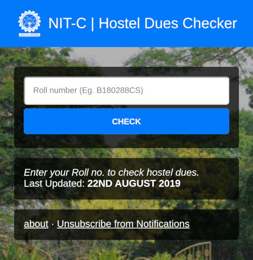

# NIT-C HOSTEL DUES

## Setup
1. Install NodeJS and NPM
        
        sudo apt install nodejs npm
2. Clone the repository and cd into it
        
        git clone git@github.com:anandubajith/nitc-hostel-dues.git && cd nitc-hostel-dues
        
3. Install dependencies with `npm install`

4. Generate `service-key.json`
    1. In the Firebase console, open Settings > Service Accounts.
    2. Click Generate New Private Key, then confirm by clicking Generate Key.
    3. Securely store the JSON file as `service-key.json`
    
5. Setup Enviornment Variables
    1. Create `.env` file with following contents
                
            onesignal_app_id=<APP_ID>
            onesignal_api_key=<API_KEY>
            
    2. Replace the values with OneSignal > Settings > Key & IDs
    
6. Run `npm run deploy` to deploy the app to Firebase

7. Run `npm run update` to download the files and update dues in Firebase Database

8. Run `npm run notify` to send push notification using OneSignal
