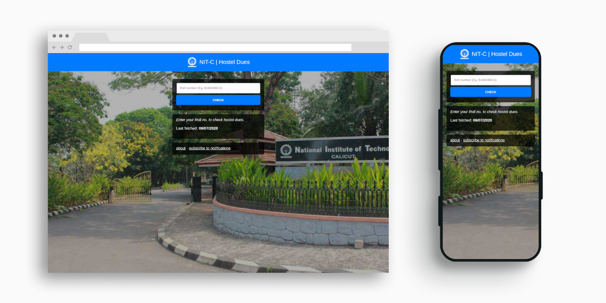

# NIT-C HOSTEL DUES

## Setup
1. Install NodeJS and NPM

2. Install and login to [Firebase CLI ](https://firebase.google.com/docs/cli)

3. Clone the repository and cd into it

        git clone git@github.com:anandubajith/nitc-hostel-dues.git && cd nitc-hostel-dues
        
4. Install dependencies for cloud functions `npm --prefix functions install`

5. Take note of OneSignal credentials by going to OneSignal > Settings > Key & IDs

6. Setup OneSignal credentials for Cloud Functions

        firebase functions:config:set onesignal.app_id="<ONESIGNAL_APP_ID>" onesignal.api_key="<ONESIGNAL_API_KEY>"

7. Deploy the project using `firebase deploy`
